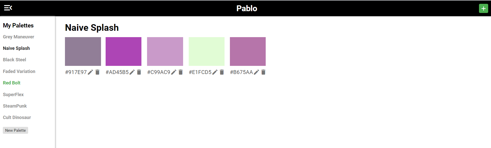

# Pablo

[Pablo](https://ajsaraujo.github.io/pablo/index.html) is a color palette manager. You can use it to manage multiple palettes in one place, no matter what you're working on. With Pablo, you can optimize your workflow by having a view of all the colors your working with and easily copying them to your clipboard.

Try out it online [here](https://ajsaraujo.github.io/pablo/index.html)!

[](https://ajsaraujo.github.io/pablo/index.html)

## Installing and Running

All you'll need is [Git](https://git-scm.com/), [Node](https://nodejs.org/en/) and [Angular](https://angular.io/cli).

```
# Clone the project
git clone https://github.com/ajsaraujo/pablo.git

# Navigate to project folder
cd pablo

# Install dependencies
npm i

# Serve the website
ng serve
```

Pablo will then be available at http://localhost:4200.

## Contributing

Pablo is meant to be a simple project that anyone can contribute to and learn something by doing it. If you want to contribute to the project, just follow these steps:

1. Read the [first contributions guide](https://github.com/firstcontributions/first-contributions).
2. Comment on the issue you want to work on. If you have an idea that isn't on an issue yet, create the issue.
3. Fork the repository.
4. Clone your fork.
5. Make your changes locally.
6. Push them to your fork.
7. Create a Pull Request from your fork to the repository's `develop` branch.

We'll then review it as soon as possible. If you're stuck with something, send an email to allanjuansil@gmail.com and we'll try our best. Keep in mind that refactorings are more than welcome!
